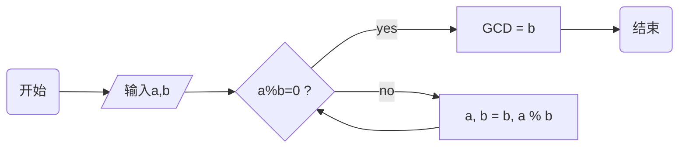

# 乱数假文

在[出版](https://www.wikiwand.com/en/Publishing)和[平面设计](https://www.wikiwand.com/en/Graphic_design)中，**lorem ipsum**（源自拉丁语*dolorem ipsum*，翻译为“痛苦本身”）是一个[填充文本](https://www.wikiwand.com/en/Filler_text)，通常用于演示文档或视觉呈现的图形元素[^1]

## 样例文本

常见的*lorem ipsum*起头如下：

> Lorem ipsum dolor sit amet, consectetur adipiscing elit, sed do eiusmod tempor incididunt ut labore et dolore magna aliqua. Ut enim ad minim veniam, quis nostrud exercitation ullamco laboris nisi ut aliquip ex ea commodo consequat. Duis aute irure dolor in reprehenderit in voluptate velit esse cillum dolore eu fugiat nulla pariatur. Excepteur sint occaecat cupidatat non proident, sunt in culpa qui officia deserunt mollit anim id est laborum.
>
> 我必须向你们解释，谴责快乐和赞美痛苦的这一错误观念是如何诞生的，我将给你们一个完整的系统说明，并阐述真理的伟大探索者，人类幸福的主要建造者的实际教导。


内联样式支持**粗体**、*斜体*、`code`、<u>下划线</u>、~~删除线~~、:haha:、$\LaTeX$、X^2^、H~2~O、==高亮==、[链接](typora.io)和图像：


块级元素包含：

### 标题3

#### 标题4

##### 标题5

###### 标题6

| 　左对齐　 | 　中心对齐　 | 　右对齐　 |
| :------------ | :-------------: | ------------: |
| 第3栏 |　一些冗长的文字　 | $1600　 |
| 第2栏    | 居中　|12美元|
| 　斑马条纹|整齐| 1美元　 |

1.  有序列表项
2.   有序列表项2
    +   无序列表项1
    +   无序列表项2. 
        *   [x] 表示已完成。 ***==(请尽量不要使用此功能，因为它的对齐效果不佳)==***
        *   [ ] 表示未完成。

*   项目1 
    *   项目2 
        *   项目3 

1. 项目1 
2. 项目2 
    1. 项目2.1 
    2. 项目2.2 
        1. 项目2.2.1 
        2. 项目2.2.2

```html
<!DOCTYPE html>
<html>
<body>

<h1>The *= Operator</h1>
  
<p id="demo"></p>

<script>
var x = 10;
x *= 5;
document.getElementById("demo").innerHTML = x;
</script>

</body>
</html>
```



[TOC]

[^1]: 从 https://en.wikipedia.org/wiki/Lorem_ipsum *Forke*得到

