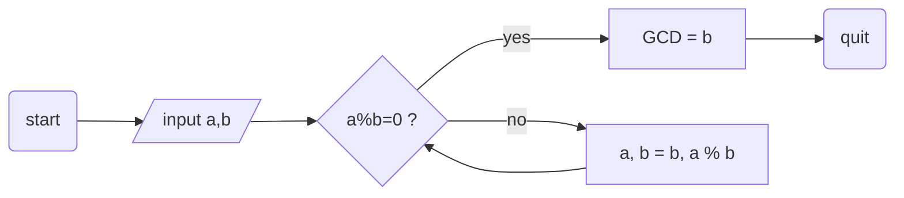

# Lorem ipsum

In [publishing](https://www.wikiwand.com/en/Publishing) and [graphic design](https://www.wikiwand.com/en/Graphic_design), **lorem ipsum** (derived from Latin *dolorem ipsum*, translated as "pain itself") is a [filler text](https://www.wikiwand.com/en/Filler_text) commonly used to demonstrate the graphic elements of a document or visual presentation. [^1]

## Example text

A common form of *lorem ipsum* reads:

> Lorem ipsum dolor sit amet, consectetur adipiscing elit, sed do eiusmod tempor incididunt ut labore et dolore magna aliqua. Ut enim ad minim veniam, quis nostrud exercitation ullamco laboris nisi ut aliquip ex ea commodo consequat. Duis aute irure dolor in reprehenderit in voluptate velit esse cillum dolore eu fugiat nulla pariatur. Excepteur sint occaecat cupidatat non proident, sunt in culpa qui officia deserunt mollit anim id est laborum.

----


Inline styles support **strong**, *Emphasis*, `code`, <u>underline</u>, ~~strikethrough~~, :haha:, $\LaTeX$, X^2^, H~2~O, ==highlight==, [Link](typora.io), and image:


Block level contains:

### Heading 3

#### Heading 4

##### Heading 5

###### Heading 6 

| 　Left-Aligned　 | 　Center Aligned　 | 　Right Aligned　 |
| :------------ | :-------------: | ------------: |
| 　col 3 is    | 　some wordy text　 |       $1600　 |
| 　col 2 is    |    centered     |         $12　 |
| 　zebra stripes |    are neat     |          $1　 |

1. ordered list item 1.
2. ordered list item 2.
   + sub-unordered list item 1.
   + sub-unordered list item 2.
     + [x] something is DONE.  ***==(Please Do NOT Use This feature, for it's not well polished)==***
     + [ ] something is not TODO.


* item 1
    * Item 2
        * Item 3

1.  Item 1
2.  Item 2
    1.  Item 2.1
    2.  Item 2.2
        1.  Item 2.2.1
        2.  Item 2.2.2

```html
<!DOCTYPE html>
<html>
<body>

<h1>The *= Operator</h1>
  
<p id="demo"></p>

<script>
var x = 10;
x *= 5;
document.getElementById("demo").innerHTML = x;
</script>

</body>
</html>
```



[TOC]

[^1]: *Forked* from https://en.wikipedia.org/wiki/Lorem_ipsum