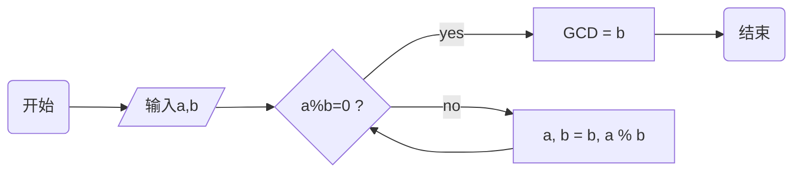

<div class="cover" style="page-break-after:always;font-family:方正公文仿宋;width:100%;height:100%;border:none;margin: 0 auto;text-align:center;">
    <div style="width:60%;margin: 0 auto;height:0;padding-bottom:10%;">
        </br>
        
    </div>
    </br></br></br></br></br>
    <div style="width:60%;margin: 0 auto;height:0;padding-bottom:40%;">
        
	</div>
    </br></br></br></br></br></br></br></br>
    <span style="font-family:华文黑体Bold;text-align:center;font-size:20pt;margin: 10pt auto;line-height:30pt;">《论文名称》</span>
    <p style="text-align:center;font-size:14pt;margin: 0 auto">论文类型 </p>
    </br>
    </br>
    <table style="border:none;text-align:center;width:72%;font-family:仿宋;font-size:14px; margin: 0 auto;">
    <tbody style="font-family:方正公文仿宋;font-size:12pt;">
    	<tr style="font-weight:normal;"> 
    		<td style="width:20%;text-align:right;">题　　目</td>
    		<td style="width:2%">：</td> 
    		<td style="width:40%;font-weight:normal;border-bottom: 1px solid;text-align:center;font-family:华文仿宋"> 论文题目</td>     </tr>
    	<tr style="font-weight:normal;"> 
    		<td style="width:20%;text-align:right;">上课时间</td>
    		<td style="width:2%">：</td> 
    		<td style="width:40%;font-weight:normal;border-bottom: 1px solid;text-align:center;font-family:华文仿宋"> 上课时间</td>     </tr>
    	<tr style="font-weight:normal;"> 
    		<td style="width:20%;text-align:right;">授课教师</td>
    		<td style="width:2%">：</td> 
    		<td style="width:40%;font-weight:normal;border-bottom: 1px solid;text-align:center;font-family:华文仿宋">教师姓名 </td>     </tr>
    	<tr style="font-weight:normal;"> 
    		<td style="width:20%;text-align:right;">姓　　名</td>
    		<td style="width:2%">：</td> 
    		<td style="width:40%;font-weight:normal;border-bottom: 1px solid;text-align:center;font-family:华文仿宋"> 你的名字</td>     </tr>
    	<tr style="font-weight:normal;"> 
    		<td style="width:20%;text-align:right;">学　　号</td>
    		<td style="width:2%">：</td> 
    		<td style="width:40%;font-weight:normal;border-bottom: 1px solid;text-align:center;font-family:华文仿宋">你的学号 </td>     </tr>
    	<tr style="font-weight:normal;"> 
    		<td style="width:20%;text-align:right;">组　　别</td>
    		<td style="width:%">：</td> 
    		<td style="width:40%;font-weight:normal;border-bottom: 1px solid;text-align:center;font-family:华文仿宋"> 你的组别</td>     </tr>
    	<tr style="font-weight:normal;"> 
    		<td style="width:20%;text-align:right;">日　　期</td>
    		<td style="width:2%">：</td> 
    		<td style="width:40%;font-weight:normal;border-bottom: 1px solid;text-align:center;font-family:华文仿宋">完成日期</td>     </tr>
    </tbody>              
    </table>
</div>
<!-- 注释语句：导出PDF时会在这里分页 -->


# 计算机工作枢纽——操作系统

<center><div style='height:2mm;'></div><div style="font-family:华文楷体;font-size:14pt;">你的名字，12345678909 （学号）</div></center>
<center><span style="font-family:华文楷体;font-size:9pt;line-height:9mm">浙江大学***** (单位)</span>
</center>
<div>
<div style="width:52px;float:left; font-family:方正公文黑体;">摘　要：</div> 
<div style="overflow:hidden; font-family:华文楷体;">在信息化时代背景下，计算机操作系统在各行业领域中得到广泛应用。本文试图通过对计算机系统概念、功能和分类、历史的介绍，大致地给出对计算机操作系统的认识，并通过对当前主流桌面操作系统Windows和macOS的简要介绍，使读者能够对现代图形界面操作系统有一个较为全面的了解，从而喜欢上某一个操作系统，供读者参考。</div>
</div>
<div>
<div style="width:52px;float:left; font-family:方正公文黑体;">关键词：</div> 
<div style="overflow:hidden; font-family:华文楷体;">计算机；操作系统；功能；发展；Windows；macOS；</div>
</div>


# Computer Work Hub — Operating System

<center><div style='height:2mm;'></div><div style="font-size:14pt;">Author</div></center>
<center><span style="font-size:9pt;line-height:9mm"><i>Zhejiang University</i></span>
</center>
<div>
<div style="width:82px;float:left;line-height:16pt"><b>Abstract: </b></div> 
<div style="overflow:hidden;line-height:16pt">Under the background of the information age, computer operating systems are widely used in various industries. This paper tries to give a general understanding of the computer operating system by introducing the concept, functions and classifications, and history of computer systems. And by briefly introducing the current mainstream desktop operating systems Windows and macOS, readers can have a comprehensive view of modern graphical interface operating systems, and get to know thus begin to like one of them. This article is for readers' reference.</div>
</div>
<div>
<div style="width:82px;float:left;line-height:16pt"><b>Key Words: </b></div> 
<div style="overflow:hidden;line-height:16pt">Computer; Operating System; Function; Development; Windows; macOS;</div>
</div>


## 什么是计算机操作系统

　　操作系统（Operating System，OS）是一组相互关联的系统软件程序，用以主管并控制计算机操作、运用和运行硬件、软件资源和提供公共服务，最终来组织用户交互，更是也是计算机系统的核心支撑。操作系统需要处理如管理与配置内存、决定系统资源供需的优先次序、控制输入与输出设备、操作网络与管理文件系统等基本事务，以帮助用户使用计算机。操作系统也提供一个让用户与系统交互的操作界面，有些操作系统集成了图形用户界面，而有些仅使用命令行界面。^[1]^

## 操作系统的功能、结构和分类

### 操作系统的功能

　　简单地说，操作系统管理并分配资源、调度和运行程序，位于底层硬件与用户之间，帮助用户和机器进行交互，架起了一座沟通用户与机器的桥梁：用户在操作系统的用户界面中输入命令；而操作系统则对命令进行解释，驱动硬件设备，以实现用户的要求。^[2]^ 一个符合现代标准个人电脑的操作系统一般应该提供以下的功能：

#### 进程管理（处理器管理）

　　在系统运行过程中，通过实施CPU分配策略，中央处理器可以根据计算机操作系统运行情况、所需执行程序命令内容，将各项程序任务进行合理分配，以保证系统运行稳定、命令得到有效执行。
　　这分为四个方面：进程控制、进程同步、进程通信、调度。
　　进程控制，是在并发执行多个作业时，为作业窗创建、终止进程，以及对进程在运行中状态改变的控制。
　　下面随便放了一段东西：

##### 数学方法（假定）

　　根据*Zhejiang University Theorem*可知，该设想的处理过程是一个二重积分：
$$
\iint\limits_{x^2 + y^2 \leq R^2} f(x,y)\,\mathrm{d}x\,\mathrm{d}y = \int_{\theta=0}^{2\pi} \mathrm{d}\theta\int_{r=0}^R f(r\cos\theta,r\sin\theta) r\,\mathrm{d}r\, \tag{1}
$$
其中$x$表示我们在卷的路上的行进距离。再由卷王公式
$$
\frac{x^{2}}{1-x^{2}}+\frac{y^{2}}{1-y^{2}}+\frac{z^{2}}{1-z^{2}} \geq \frac{3 \sqrt{3}}{2}
$$
我们有了下面的数据处理方法。下面是我们的流程图表示说明：


<center><strong>图 1  算法的流程图表示（假定）</strong></center>

有了这个流程图，我们就可以根据它编写python程序代码。

##### 算法的代码实现（假定）

```python
from functools import cmp_to_key
def cmpkey2(x,y):
    if x[1]>y[1]: return  1
    elif x[1]<y[1]: return  -1
    elif x[0]>y[0]: return  -1
    elif x[0]<y[0]: return  1
    return 0
#input session
text = ""
while True:
    ts = input()
    if ts == '!!!!!': break
    text += ' '; text += ts
    text = text.lower()
for ch in '!.,:*?': text=text.replace(ch, ' ')
#count session
cnt = {}
for word in text.split(): cnt[word] = cnt.get(word, 0) + 1 
#sort session
cont = list(cnt.items())
d = cont.sort(key=cmp_to_key(cmpkey2),reverse=True)

print(len(cont))
for i in range(10):
    if i>=len(cont):
        break
    key, val = cont[i]
    print(f"{key}={val}")
```
　　……

####  存储管理

　　这项系统功能主要包括：
　　……

####  设备管理（驱动程序）

　　计算机操作系统中配置多种不同的硬件设备，且不同类型设备的规格、性能间存在明显差异。而对设备管理功能的配置，可以加强硬件设备的管理力度，提高设备实际利用率。[2] 这项系统功能具体包括：
　　……

#### 文件管理

　　计算机操作系统中的各类程序任务、所分布软件资源、实时产生数据均以文件形式进行外存。而文件管理功能的使用目的在于，对系统所存储文件进行空间分配、目录管理，根据用户提出请求来下达相应的操作命令。[2]
　　此功能分为文件存储空间的管理、目录管理、文件的读写管理和保护：
　　……

### 操作系统的结构

　　……

## 操作系统的发展

　　经过漫长的发展，操作系统逐渐成为今天我们熟悉的样子。从古至今，是一位位伟大的科学家和优秀的程序员共同努力才为我们带来了当今如此惊艳的伟大软件。

　　……

### 操作系统的现状

　　现代操作系统通常都有一个亲切美丽的图形用户界面，并使用如鼠标、触控版等有别于键盘的输入设备提供用户交互。

　　……

#### 个人电脑

　　个人电脑市场目前分为两大阵营，此两种架构分别有支持的操作系统：

| <span style="font-family:'Latin Modern Roman',宋体-简;font-weight:750">Apple  Mac</span> | <span style="font-family:'Latin Modern Roman',宋体-简;font-weight:normal">macOS（原Mac OS X）、Windows（当前仅支持Intel平台，但有消息称ARM版Windows也即将支持使用Apple Silicon的Mac）、Linux、BSD </span> |
| ----------------- | ------------------------------------------------------------|
| **IBM** **兼容PC** | Windows、Linux、BSD、macOS（非正式支持，俗称黑苹果）         |

#### 移动操作系统

　　在1990年代初期，Psion推出了小型移动计算设备Psion Series 3 PDA。它支持在名为EPOC的操作系统上运行的用户编写的应用程序。EPOC的更高版本成为Symbian，被用于诺基亚、爱立信、索尼爱立信、摩托罗拉、三星等手机；塞班在2010年之前曾是世界上使用最广泛的智能手机操作系统。微软也推出过Windows Mobile系列系统，它在2007年达到顶峰时，曾是美国智能手机最常用的操作系统。
　　Microsoft于2010年通过Windows Phone重新进入了移动操作系统市场，并在2015年被更新的Windows 10 Mobile取代。Windows 10 Mobile是Windows 10操作系统的分支版本，专为屏幕尺寸低于8寸的智能手机和平板电脑运行。它采用ARM架构和IA-32处理器架构，为移动设备提供了"强大的功能"。其中包括同步处理功能、通用应用、从Android和iOS的平台移植的应用、将设备连接至外部屏幕、可使用类似PC的鼠标和键盘输入等。尽管设想与愿景十分美好，但最终呈现效果始终不尽人意。2020年1月14日，因为Windows 10 Mobile使用人数太少，欠缺App开发人员，该系统正式停止更新，最后一个版本号停留在1709（10.0.15254.603）。许多人对Windows 10 Mobile的结局感到痛心疾首，读者可以通过[这里](https://www.microsoft.com/en-us/windows/windows-10-mobile-specifications)尝试为您的手机安装该系统。
　　Apple在2007年推出了iPhone及其操作系统，后者称为iPhone OS（也就是如今的iOS），它与Mac OS X一样，都基于类似Unix的Darwin。除了这些基础之外，它还引入了功能强大且创新的图形用户界面，该界面后来也用于Apple的平板电脑iPad上。（后来Apple将iPad上的操作系统与手机端区分开，改叫iPadOS。）一年后，基于经过修改的Linux内核，Google引入了具有自己的图形用户界面的Android。
　　截止本文完稿，iOS已更新至iOS 14.3；Android已更新至Android 11（Beta 3）。读者可以分别点击[这里](https://www.apple.com.cn/ios/)和[这里](https://android.com/)查看关于这两个操作系统的更多官方信息。
　　除了这些，移动领域还竞争着各种各样的其他移动操作系统。不过如今移动端主流的操作系统只有iOS和Android系统及基于Android内核修改的其他“换壳”安卓系统。

<center><strong>表 1  全球/中国移动操作系统市场份额占比（%）</strong></center>

| OS   | Android | iOS   | Windows | 其他 |
| ---- | ------- | ----- | ------- | ---- |
| 全球 | 72.48   | 26.91 | 0.02    | 0.59 |
| 中国 | 80.54   | 18.38 | 0.03    | 1.05 |

　　**表 1**展示了由互联网机构StatcCounter网站提供的数据截止2020年12月移动端全球与中国各移动操作系统市场份额占比。随着中国国产手机品牌的不断壮大，安卓系统的手机市场份额也在不断扩大。

## 当前主流操作系统简介

　　现阶段，应用较为常见的桌面计算机操作系统为三类，分别为Windows系统、Linux系统、Unix类系统。其中，Windows系统的技术体系较为成熟，图形化模式界面较为人性化，是当前PC端主流系统。Unix系统使用标准化的认证规范，用户可以直接在系统中移植相应应用程序，系统具有功能完备、稳定性强的应用优势，主要被用与网络服务器。但是，Unix系统对硬件配置有着较高的要求。另外，Apple公司的操作系统macOS也是Unix的变体。Linux系统则具有开源免费的应用优势，且系统软件环境较为良好，系统资源占用极低，可以长期保持开机（甚至除非更新内核安装更新也无需重启），在嵌入式、服务器操作系统领域中得到广泛应用，大有取代Unix之势。

　　<table style="border:none;text-align:center;width:auto;margin: 0 auto;">
	<tbody>
		<tr>
			<td style="padding: 6px"></td><td></td>
		</tr>
        <tr><td><strong>图 8  全球操作系统市场份额</strong></td><td><strong>图 9  中国操作系统市场份额</strong></td></tr>
	</tbody>
</table>

　　根据互联网机构StatcCounter网站提供的数据，截止2020年12月20日，全球与中国各桌面级操作系统市场份额占比分别如**图 8**、**图 9**所示，具体数据见**表 2**。

<center><strong>表 2  全球/中国桌面操作系统市场份额占比（%）</strong></center>

| OS   | Windows | macOS | Unknown | Linux | Chrome OS | 其他 |
| ---- | ------- | ----- | ------- | ----- | --------- | ---- |
| 全球 | 76.56   | 17.1  | 2.68    | 1.93  | 1.72      | 0.01 |
| 中国 | 87.55   | 5.44  | 6.24    | 0.75  | 0.01      | 0.01 |

　　从中我们可以看出，Windows是依旧最受欢迎的主流桌面操作系统，市场占有率极大。在中国Windows对其他操作系统的优势进一步加大，达到了惊人的88%。当然，这与国内早期的盗版软件生态是分不开的。同时，国内很多早期的项目机器仍旧停留在Windows XP系统而不选择换用Unix服务器系统，这也进一步造成了差距的扩大。
　　下面我们对市场占有率最高的两个操作系统Microsoft Windows和Apple macOS进行介绍。

### Microsoft Windows

　　Microsoft Windows是微软公司以图形用户界面为主推出的一系列专有商业软件操作系统。……

### macOS

　　 macOS（2011年及之前称Mac OS X，2012年至2015年称OS X）是Apple公司推出的专为Mac系列电脑开发的基于图形用户界面的操作系统。
　　  ……
　　 笔者就拥有一台MacBook Pro，macOS的用户体验非常舒适，特别是当macOS与iOS、iPadOS等系统同时交互时，接力、随航、隔空投送及iCloud同步等苹果生态带来的流畅感和便捷性是Windows无法替代的。同时，macOS的自动保存技术也一次次拯救了笔者多次崩溃的Adobe Photoshop和Adobe Illustrator，设计师的心再也不会像在Windows平台那样因为一个崩溃提示而化为齑粉。
　　 读者可以前往[Apple官网](https://www.apple.com.cn/macos/)进一步了解macOS。由于非Mac机器很难装载macOS系统，有条件的读者可以前往Apple Store体验或购买一台Mac。

## 结语

　　 综上所述，计算机操作系统一步一步走到今天，已经和人们的生活紧密相连。计算机是一个高速发展的行业，它无时不刻不在更新着，而正是因为系统功能的不断进步，我们的生活也越来越方便快捷。“Windows”“iOS”“安卓”已经是妇孺皆知的概念，我们无法想象失去了操作系统的生活。感谢那么多科学家、工程师、开发者为我们带来了那么多优秀美丽的操作系统，也相信在未来的发展下，计算机系统也会在不断优化完善的路上越走越远。


**参考文献:** 

［1］  维基百科编者.操作系统[G/OL].维基百科,2020(2020-11-24) [2021-01-09]. https://zh.wikipedia.org/w/index.php?title=操作系统&oldid=62920825.
［2］  计算机操作系统及发展探讨.田舜文[J].数码设计  （下）2020,9(6):3.
［3］  计算机操作系统功能与其相关分类.宋辰辉[J].电脑迷,2018(7):15.
［4］  苏志明.计算机操作系统的功能、发展及分类[J].企业技术开发,2012,31(32):77-78.
［5］  严静茹.浅谈计算机操作系统及其发展[J].计算机光盘软件与应用,2012(10):80+82.
［6］  Milo. History of Operating Systems [Z/OL]. (2010-10-03) [2021-01-09]. http://www.osdata.com/kind/history.Htm
［7］  维基百科编者.操作系统历史[G/OL].维基百科,2020(2020-02-29) [2021-01-09]. https://zh.wikipedia.org/w/index.php?title=操作系统历史&oldid=58390753.
［8］  Wikipedia contributors. History of operating systems [G/OL]. Wikipedia, 2020(2020-12-21)[2021-01-10]. http://en.wikipedia.org/w/index.php?title=History_of_operating_systems&oldid=995571854
［9］  Statcounter. Mobile Operating System Market Share Worldwide [DS/OL]. (2020-12-20) [2021-01-09]. https://gs.statcounter.com/os-market-share/mobile/worldwide/
［10］ Statcounter. Mobile Operating System Market Share China [DS/OL]. (2020-12-20) [2021-01-09]. https://gs.statcounter.com/os-market-share/mobile/china/
［11］ Statcounter. Desktop Operating System Market Share Worldwide [DS/OL]. (2020-12-20) [2021-01-09]. https://gs.statcounter.com/os-market-share/desktop/world-wide/
［12］ Statcounter. Desktop Operating System Market Share China [DS/OL]. (2020-12-20) [2021-01-09]. https://gs.statcounter.com/os-market-share/desktop/china/
［13］ 维基百科编者.Microsoft Windows[G/OL].维基百科, 2021(2021-01-02)[2021-01-10]. https://zh.wikipedia.org/w/index.php?title=Microsoft_Windows&oldid=63546256.
［14］ 韩兵,李海坤.浅谈Windows操作系统[J].数码世界,2017(06):66-67.
